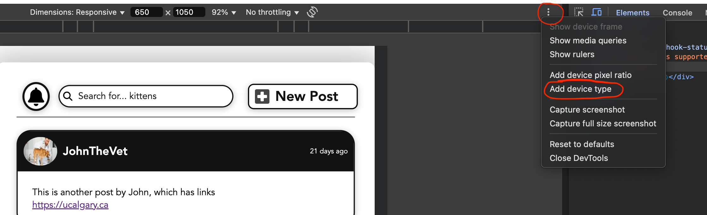
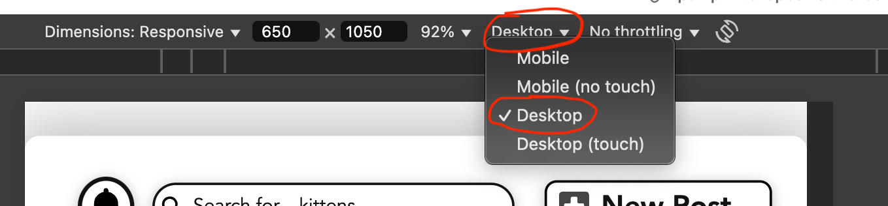

# CPSC 481 - PawPrints

## Team Members
- AbdulRahman AbdulJabar, abdulrahman.abduljab@ucalgary.ca
- Simon Bondad, simon.bondad@ucalgary.ca
- Joshua Meetsma, joshua.meetsma@ucalgary.ca
- Brian Nguyen, brian.nguyen3@ucalgary.ca
- Aidan Wong, aidan.wong1@ucalgary.ca

## How to interact with PawPrints
- Visit https://pawprints-cpsc481.vercel.app/
- Enable Responsive Design Mode via Inspect Element
- Set the resolution to 650x1050
- Add the Device Type via the 3 dots on the top right hand corner (images are from a Chromium based browser)

- Set the device type to Desktop



# PawPrints App User Guide
Some general notes:
```
Due to how the data is managed in the application, if you refresh the page
the application will generally revert back to its original state. Keep this in mind during testing.
For the purposes of testing this application, we will assume thap you have signed in with an email and password.
For your testing, your initial user account is named as "Olivia." A different user, "JohnTheVet" is also utilized in some places.
```

## 1. Profile Page

### 1.1. Setting up your profile
1. Click on the profile icon on the footer to enter the profile page and view the existing profile.
2. Use the gear icon in the top right corner to enter your profile settings.
3. Update your profile details:
   - Change your username (e.g., "OliviaLikesPets" or "Olivia123").
   - Select a location (e.g., "British Columbia").
   - Optionally enter a date of birth.
   - Update the About Me section (e.g., "Hello! I am a pet enthusiast and this is my profile!").
4. Select the camera icon in the top left to upload a profile picture.
5. Save your changes.

### 1.2. Managing profile settings
1. **Privacy settings:**
   - Configure your privacy preferences as desired.
   - Note: Later in the demo, you'll see a profile with "Who Can Message Me" set to friends only.
2. **Notifications:**
   - Default values are recommended for testing.
   - You'll see examples of notifications you would receive in normal use.

### 1.3. Creating a pet profile
1. To add a pet profile:
   - Enter a pet name (e.g., "Scratch").
   - If you accidentally click "return to profile," observe the behavior.
   - Skip the extra treat day option if desired.
   - Select a profile picture for your pet using the camera icon.
   - Add an About Me for the pet (e.g., "Scratch is a fun dog who loves to play fetch!").
2. Save your changes and return to your profile.
3. Your updated profile will now display your pet information.

## 2. Home Page

### 2.1. Navigating the Home Page
1. Access the Home Page by:
   - Opening the application for the first time, or
   - Clicking the Home button in the footer.
2. The Home Page contains several key elements:
   - Notification Center (bell icon)
   - Search bar
   - New Post button
   - Feed

### 2.2. Using the Feed
1. Browse the pre-loaded posts showcasing various features.
2. Click on a user's name at the top of a post to visit their profile page.
3. Use the buttons below each post to:
   - Save the post (feature under development)
   - Reply to a post (feature under development)

### 2.3. The Notification Center
1. Click the bell icon to access the Notification Center.
2. View the summary of recent posts.
3. Note that clicking a user's name does not currently navigate to their profile.

## 3. Search Page

### 3.1. Accessing the Search page
1. Click the search bar at the top of the Home page.
2. Use the navigation buttons for Events or Groups to access their specific search functions.

### 3.2. Using the Search function
1. Set your desired filters:
   - Enter text in the search bar to find specific content in posts (e.g., "first post").
   - Results will include posts containing the exact, case-insensitive search terms.
   - Note: Search only examines post text, not usernames, dates, or image links.
2. Click the Search button or press Enter to apply filters and view results.

### 3.3. Using additional filters
1. **Animal Type categories and Followed users:**
   - These features are currently under development.
2. **Saved posts:**
   - Filter posts by saved status.
   - The database includes one pre-saved post.
3. **Clearing filters:**
   - Clear individual filters manually.
   - Use the Clear Search Criteria button to reset all filters (hovering turns it red on desktop).

### 3.4. Viewing Search Results
1. After applying filters, the search results page will display:
   - A title reflecting your search query (if specified)
   - Posts matching your search criteria
2. Interact with results the same way as posts on the Home page.
3. Navigate using:
   - The back arrow to return to the search page (retaining your criteria)
   - The navigation bar to return to the Home page

## 4. Creating a New Post

### 4.1. Starting a new post
1. Return to the Home page and press the New Post button.
2. Enter your post text in the main textbox.

### 4.2. Additional post features
1. **Animal Type Categories:**
   - This feature is still under development.
2. **Shop and Event Links:**
   - These features are under development.
   - Use the provided buttons to navigate to Events or Shop sections.
   - Note: Using these buttons will erase current post progress.
3. **External Links:**
   - Add an external link to create a navigable hyperlink below the post.
4. **Sponsored Posts:**
   - Check the box to display "This post is a sponsored advertisement" beneath the post.

### 4.3. Publishing or canceling
1. Click the Publish Post button to publish and return to the Home page.
2. Use the cancel button or navigate away to discard the post.

## 5. Events Page

### 5.1. Accessing and navigating events
1. Click on the calendar icon in the footer to access the Events page.
2. Navigate between different views:
   - Click "Day" for a single day view
   - Click "Week" for a weekly overview
   - Click "Month" for the monthly view (default)
3. Use the arrows in the top left to navigate between time periods.
4. Notice that events you're hosting or have joined appear slightly faded.

### 5.2. Joining an event
1. Click on any non-grayed out event in the calendar.
2. In the popup asking "Would you like to join [Event Name]?":
   - Click "Confirm" to join
   - Click "Cancel" to decline

### 5.3. Searching for events
1. Type in the search bar (e.g., "adoption" or "training").
2. Observe how the calendar filters to show matching events.
3. View matching events in the "Search Results" section below.
4. Click "Join" on any search result to participate.
5. Use the filter to the right of the search bar to narrow results further.

### 5.4. Managing your events
1. In the "Events I'm Hosting" section:
   - Click "Edit" to modify event details
   - Click "Delete" to remove an event (deletes all occurrences of recurring events)
2. In the "My Upcoming Events" section:
   - Click "Leave" to withdraw from an event you've joined

### 5.5. Creating new events
1. Click the "+ New Event" button in the top right.
2. Fill in the event details:
   - Title (e.g., "Dog Training Workshop")
   - Description (e.g., "Basic obedience training for puppies")
   - Date and time using the date picker
   - Location (e.g., "Central Park Dog Area")
   - Event type from the dropdown (e.g., "Training")
3. For recurring events:
   - Toggle "Recurring Event" ON
   - Select frequency: Weekly, Biweekly, or Monthly
   - Set an end date (optional)
4. Click "Create Event" to add your event to the calendar and "Events I'm Hosting" section.

## 6. Group Page

### 6.1. Browsing, searching, and filtering groups
1. Tap the **Groups** icon in the footer to open the **Browse Groups** page.
2. In the search bar at the top, type **Dog** and press Enter – only dog‑related groups should appear.
3. Clear the search text to reset the list.
4. Expand the **Filters ▾** panel:
   - Use the **Animal Type** dropdown and pick **Dog** – groups whose animal type is Dog should appear.
   - Switch **Group Type** between **Public** and **Invite Only** to see the list update.
   - Choose a **Location** such as **Calgary, AB** to narrow results geographically.
5. Click the **✕** beside **Filters** to clear all filters and restore the full list.
6. Press **Join** on any public group (e.g., **New Dog Owners**).
   - The button text changes to **Cancel Request** (or **Leave Group** if auto‑approved).
   - Press it again to verify you can withdraw the request.

### 6.2. Creating a new group
1. From **Browse Groups**, hit the **＋ New Group** button in the top‑right corner.
2. Fill in the form:
   - **Title:** "Calgary Cat Lovers"
   - **Description:** "A friendly place to swap cat care tips."
   - **Location:** "Calgary, AB"
   - **Animal Type:** select **Cat**
   - **Group Image:** upload any square image of a cat
   - **Joining Policy:** leave as **Public** (or switch to **Invite Only** to test that flow)
3. Press **Save** – you should be redirected back to **Browse Groups** and see the new group listed.
4. Tap on the group you just created; because you are the creator, membership is instant and the button should now read **Joined**.

### 6.3. Interacting inside a group
1. Click the group card to enter the **Group Detail** page.
2. Verify the header shows the group image, name, location, member count, and the buttons **Create Post** & **Leave Group**.
3. **Viewing members:**
   - Click the member‑count link (e.g., "46 members").
   - A popup/modal should list all current members; close it with the **Close** button.
4. **Creating a post:**
   - Hit **Create Post**.
   - In the dialog, type "Does anyone have tips for crate training?" and press **Post**.
   - Confirm it appears at the top of the feed with your username.
5. **Leaving the group:**
   - Press **Leave Group**.
   - When prompted if you are sure you want to leave the group, tap Yes to agree or Cancel.
   - You should be returned to **Browse Groups** and the button on that card reverts to **Join**.
6. **Deleting a group:**
   - Press **Delete Group**.
   - You will be asked to confirm if you want to delete the group or not.
   - Tap Yes, Delete or Cancel.

## 7. Shop Page

### 7.1. Exploring the Shop page
1. Click on the shop icon in the bottom navigation bar to enter the shop page.
2. Browse the catalog of pet-related products.
3. Use the search functionality:
   - Type something into the search bar (e.g., "dog").
   - Try using the filter icon to narrow by category or price.
   - Apply combinations of search queries and filters.
4. When filters are applied, click the gray filter button to clear them.

### 7.2. Adding items to your cart
1. Scroll through the catalog and find an item you like.
2. Click the "Add to Cart" button.
3. Notice the button updates to show how many of that item are in your cart.
4. Click it again to add more of the same item.
5. Repeat with different products to fill your cart.

### 7.3. Managing your cart
1. Tap the cart icon in the top right to open your cart.
2. Review all added items and the subtotal at the bottom.
3. Manage quantities:
   - Increase an item's quantity using the plus (+) icon.
   - Decrease it with the minus (-) icon.
   - Remove it completely using the trash icon.

### 7.4. Completing checkout
1. Click the checkout button at the bottom of the cart page.
2. You'll be taken to a success screen that confirms your order.
3. Note that no payment information is required for this prototype.